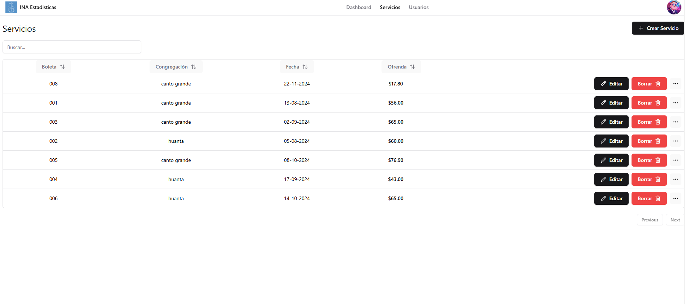

# INA Estadísticas App

Este es un proyecto para la gestion de reuniones de servicio para una Iglesia.

## Tecnologías
<table align="center">
  <tr>
    <td align="center">
      <a href="https://www.typescriptlang.org/">
         
        TypeScript
      </a>
    </td>
    <td align="center">
      <a href="https://es.react.dev/">
         
        React
      </a>
    </td>
    <td align="center">
      <a href="https://firebase.google.com/">
         
        Firebase
      </a>
    </td>
    <td align="center">
      <a href="https://tailwindcss.com/">
       
        Tailwind
      </a>
    </td>  
    <td align="center">
      <a href="https://vite.dev/">
       
        Vite
      </a>
    </td>
    <td align="center">
      <a href="https://ui.shadcn.com/">
       
        Shadcn/UI
      </a>
    </td> 
    <td align="center">
      <a href="https://vercel.com/">
       
        Vercel
      </a>
    </td>
  </tr>
</table>

## Capturas

### Autentificación

### Dashboard

### Servicios

### Usuarios y roles

